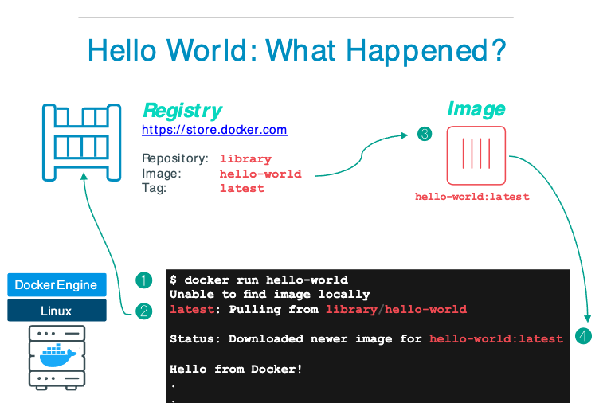

### Challenge 0

Objective:
- Learn how to list, pull, delete images.
- Learn how to run containers, understand what containers are, how to list them, and how to override their default commands.


```sh
$ docker container run hello-world
```




```sh
$ docker image ls
# You should see a listing of docker images

$ docker image pull alpine
$ docker image ls
# You should see alpine now listed
# These images can now be used to run containers

$ docker container ls
# This should list any running containers you have. Please note the `running` keyword.
```

#### Run Commands Inside a Container

Let's run some commands inside a container:

```sh
$ docker container run alpine ls -l
$ docker container run alpine ifconfig
```

This command will create a container based on the Alpine image, then execute the `ls -l` command inside that running container. The container will stop directly after the execution of `ls -l` completes.  

### Task 1 (10mins)
Find the command that executes when we run a container from the `alpine` image.  
Bonus: What about for the `hello-world` comand?  
**HINT**:  
Use `docker image --help` to view a list of commands and find a command that we can use to view the most recent changes of an image.
The command is usually signified by the `CMD` keyword.

---
#### Interactive Access to Containers

How do we get interactive access to the container? We need two pieces to achieve that. First, the `-it` option passed to `docker container run` and also specifying `/bin/sh` or `/bin/bash` at the end of the command. By overriding the default command of the container with the binary executable for the terminal, we trick Docker into giving us a terminal inside the container.

```sh
$ docker container run -it alpine /bin/sh
...
$ exit # Run this from your container, and we're going to investigate some things about the exited container
```

You should notice by this point that every time you perform a `docker container run`, you will end up with a completely new container. This is because of the nature of `docker container run`, which will effectively perform both a `docker container create` & `docker container start` command. It's just an easier way to do it.


#### Running Containers in the Background

Let's make sure you don't have any containers still running.

```sh
$ docker container run -d alpine sleep 600
$ docker container ls
# Some of the details will be a bit different for you
CONTAINER ID   IMAGE     COMMAND      CREATED          STATUS          PORTS     NAMES
859995aa421b   alpine    "sleep 600"   37 seconds ago   Up 36 seconds             exciting_pare
```

#### Investigate a Container

Let's investigate some details about exited containers.

First, let's find our exited container.

```sh
$ docker container ls -a
```
You'll notice that by default `docker container ls` only shows running containers. To list all containers, including the exited ones, use the `-a` flag.

### Task 2 (15mins)
Here you'll have a couple tasks to handle.
0. For this task we want to grab a new image of `nginx`.
    - **HINT**: Use `docker image --help` and in the list of commands use one of them to download an image from the default docker registry
1. Startup a container (if you haven't already) based on the `nginx` image
    - NOTE: If your container dies while you're working, i.e. you get a response that the container is not running, then you need use what you've learned to find the stopped container, start it, then continue onwards.
2. Use a docker command to view which processes are running on the container. Identify the Process ID (PID) and the User ID (UID) of the "master" nginx process.
    - **HINT**: Use `docker container --help` to get a listing of all the commands you an execute against containers. 
3. We want to make sure how much maximum memory this container can actually use, how much memory it's curently using, and what the CPU usage is. For the docker container you've been using please identify this information.
    - ***BONUS***: How can we stop the command from actually taking over our terminal?
    - **HINT**: Use `docker --help` to look through the list of available commands. There will be a lot of commands listed, you're primarily interested in finding the command that will give you the resource usage statistics
    - If this command effectively "locks" your terminal and you can't press any buttons just do `CTRL+c`, it's the universal "get me out of here" shortcut in most all things. `CTRL+d` is the more serious version for those situations when you're scared of your terminal.


#### Cleanup

Once you're finished with these exercises, you can remove the images and containers to clean up your environment.

```sh
$ docker image ls                      # List images, images can take up a lot of space
$ docker container ls                  # List currently running containers
$ docker container rm [CONTAINER_ID]   # Removes a container
$ docker image rm nginx                # Removes the nginx image, optional but it does take up space
```

